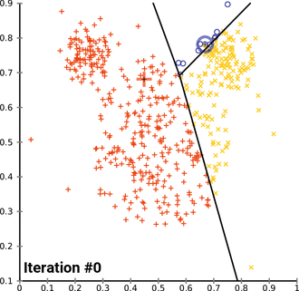
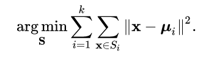

O objetivo desse notebook é aplicar a Linguagem R em Ciência de Dados na resolução de problemas de forma não supervisionada. 

## Base USArrests

A base de dados USArrests contém estatísticas por 100.000 habitantes de prisões por agressão, assassinato e estupro em cada um dos 50 estados dos Estados Unidos em 1973.

```{r}
data('USArrests')
usa = USArrests
head(usa)
```

É muito importante tratar valores ausêntes. A função is.na nos diz se um elemento é NA. Combinada com a função any, podemos descobrir se algum elemento da base é NA.

```{r}
head(is.na(usa))
print(any(is.na(usa)))
```

Também é muito importante normalizar os dados. Mas poderiamos usar normalização por maxmin.

```{r}
maxmin <- function(x) {
  return (x - min(x))/(max(x) - min(x))
}

normalize <- function(df) {
  return (sapply(df, maxmin))
}

usa = normalize(usa)
head(usa)
```

Aqui vamos usar a normalização pela média e desvio padrão.

```{r}
usa = scale(usa)
head(usa)
summary(usa)
```

## kMeans

O algoritmo de agrupamento kMeans é um método de quantização vetorial, originário do processamento de sinais, que visa particionar n observações em k clusters em que cada observação pertence ao cluster com a média mais próxima (centros de cluster ou centróide de cluster), servindo como um protótipo de cluster. Isso resulta em um particionamento do espaço de dados.



O algoritmo kMeans clássico pode ser definido como a soma dos mínimos locais gerados pelos agrupamentos definido como:



Agora nossos dados estão prontos. Vamos aplicar a função de agrupamento kMeans para 2 grupos.

```{r}
cls = kmeans(usa, centers=2)
print(cls)
```

Analisando os grupos:

```{r}
cls$cluster
```

Conseguimso descobrir qual o número de grupos ideal? Uma alternativa é utilizar uma medida de validação de agrupamento como a silhueta. Para isso precisamos carregar a biblioteca cluster.

```{r}
require('cluster')
sil = silhouette(cls$cluster, dist(usa))
print(sil)
```

Podemos mostrar graficamente o valor da silhueta por amostra.

```{r}
plot(sil)
```

Ou usar a média para avaliar se o valor é bom.

```{r}
mean(sil[,3])
```

Podemos variar o número de grupos para tentar encontrar o valor ótimo de grupos baseado na medida silhueta.
 
```{r}
cls = sapply(2:10, function(k) {
  aux = kmeans(usa, centers=k)
  sil = silhouette(aux$cluster, dist(usa))
  mean(sil[,3])
})
```

Podemos plotar os valores da silhueta.
```{r}
names(cls) = 2:10
plot(names(cls), cls, type = "l")
```

Usando a biblioteca plotly.

```{r}
require(plotly)
data = data.frame(cls, k=2:10)
plot_ly(data, x=~k, y=~cls, type='scatter', mode='lines')
```

Vamos carregar duas bibliotecas para nos ajudar a visualizar os dados.

```{r}
require('gridExtra')
require('factoextra')
```

Vamos visualizar os agrupamentos.

```{r}
plot = lapply(2:5, function(k) {
  cls = kmeans(usa, centers=k)
  fviz_cluster(cls, data=usa)
})
do.call("grid.arrange", plot)
```

## Comprimindo Áudio com kMeans

Um experimento interessante é a tarefa de comprimir áudio utilizando o algoritmo de agrupamento kMeans. Para isso vamos precisar das bibliotecas audio e seewave.

```{r}
require('audio')
require('seewave')
```

Vamos baixar uma música da internet com permissão de reprodução pelo pixabay. Essa música tem o formato MP3.

```{r}
url = 'https://cdn.pixabay.com/download/audio/2021/04/07/audio_0bed53371b.mp3?filename=blues-vibes-100-bpm-michael-kobrin-3780.mp3'
download.file(url, 'audio.mp3')
```

Na sequencia, precisamos converter para WAV e pegar uma amostra para podermos demostrar a compressão. Para isso vamos usar o programa ffmpeg.

```{r}
system('ffmpeg -i audio.mp3 audio.wav')
system('ffmpeg -i audio.wav -ac 1 mono.wav')
system('ffmpeg -i mono.wav -ss 00:00 -to 00:10 out.wav')
```

Podemos carregar a música.

```{r}
sound = load.wave("out.wav")
class(sound)
```

E plotar...

```{r}
plot(sound, type = "l")
```

Usando plotly...

```{r}
data = data.frame(as.numeric(sound), x=1:length(sound))
plot_ly(data, x=~x, y=~sound, type='scatter', mode='lines')
```

Verificando quantos valores únicos temos nessa amostra.

```{r}
length(unique(as.numeric(sound)))
```

Para aplicar o kMeans, precisamos transformar esses dados.

```{r}
wave = data.frame(amp=as.numeric(sound))
summary(wave)
head(wave)
```

Agora podemos aplicar o kMeans. Vamos tentar agrupar os sinais de amplitude da música de 10 até 100 grupos.

```{r}
require('parallel')
cls = mclapply(seq(10, 100, by=10), mc.cores=6, function(k) {
  kmeans(wave, centers=k)
})
```

O resultado é algo como:

```{r}
cls[[1]]$centers
head(cls[[1]]$cluster, 100)
cmp = cls[[1]]$centers[cls[[1]]$cluster]
plot(cmp, type = "l")
```

Agora, podemos salvar alguns desses resultados do kMeans para compressão de música para diferentes valores de k e testar.

```{r}
cmp = cls[[1]]$centers[cls[[1]]$cluster]
plot(cmp, type = "l")
novoSom = audioSample(cmp)
savewav(novoSom, filename='cmpk10.wav')
```

```{r}
cmp = cls[[2]]$centers[cls[[2]]$cluster]
plot(cmp, type = "l")
novoSom = audioSample(cmp)
savewav(novoSom, filename='cmpk20.wav')
```

```{r}
cmp = cls[[5]]$centers[cls[[5]]$cluster]
plot(cmp, type = "l")
novoSom = audioSample(cmp)
savewav(novoSom, filename='cmpk50.wav')
```

```{r}
cmp = cls[[10]]$centers[cls[[10]]$cluster]
plot(cmp, type = "l")
novoSom = audioSample(cmp)
savewav(novoSom, filename='cmpk100.wav')
```

## Comprimindo Imagens com kMeans

Um experimento interessante é a tarefa de comprimir imagens utilizando o algoritmo de agrupamento kMeans. Para a compressão, o número de cores precisa ser reduzido. A redução é feita através do agrupamento das cores e seleção daquelas mais frequentes. Para isso precisamos carregar a blbioteca imager:   

```{r}
require('imager')
```

Algumas imagens são pré-carregadas pelo pacote como a imagem de barcos:

```{r}
plot(boats, axes=FALSE)
```

Vamos salvar a imagem original em um arquivo e imprimir seu tamanho em disco:

```{r}
save(boats, file='boats1.zip')
cat('Tamanho da imagem original:', file.info("boats1.zip")$size, 'bytes')
```

Podemos extrair informações sobre o objeto da seguinte forma:

```{r}
boats
dim(boats)
```

Gerando o data.frame da imagem boats:

```{r}
image = as.data.frame(boats)
# cabecalho do data.frame
head(image)
```

Podemos deixar a imagem borrada:

```{r}
plot(isoblur(boats, 10), axes=FALSE)
```

Podemos deixar a imagem em escala de cinza:

```{r}
plot(grayscale(boats), axes=FALSE)
```

Podemos remover a cor vermelha da imagem:

```{r}
test_image = image
test_image[test_image$cc == 1, 'value'] = 0
test_image = as.cimg(test_image)
plot(test_image, axes=FALSE)
```

Podemos separar as cores RGB da imagem da seguinte forma: 

```{r}
red = image[image$cc == 1, 'value']
blue = image[image$cc == 2, 'value']
green = image[image$cc == 3, 'value']
```

Reconstruindo a base de dados em um data.frame:

```{r}
data = data.frame(red, blue, green)
```

Aplicando o kMeans com 10 centroides e 500 iterações máximas:

```{r}
centroides = kmeans(data, centers=10)
summary(centroides)
```

Adicionando os centroides encontrados em data:

```{r}
data[,"cluster"] = centroides$cluster
head(data)
```

O próximo passo é reconstruir a imagem utilizando as cores identificadas como centroides. A imagem será reconstrída com as 10 cores principais:

```{r}
new_data = do.call('rbind',
  lapply(1:nrow(data), function(i) {
    centroides$centers[data[i,4],]
  })
)
```

Plotando a nova imagem:

```{r}
new_image = image
new_image$value = c(new_data[,1], new_data[,2], new_data[,3])
new_image = as.cimg(new_image)
plot(new_image, axes=FALSE)
```

Vamos salvar a nova imagem em um arquivo e imprimir o seu tamanho comprimido em disco:

```{r}
save(new_image, file='boats2.zip')
cat('Tamanho da imagem comprimida:', file.info("boats2.zip")$size, 'bytes')
```

Antes de continuar com o experimento, vamos construir a função imageGenerator que recebe uma imagem e o número de centroides e retorna uma nova imagem comprimida:

```{r}
imageGenerator <- function(image, centers) {
  
  image = as.data.frame(image)
  red = image[image$cc == 1, 'value']
  blue = image[image$cc == 2, 'value']
  green = image[image$cc == 3, 'value']
  data = data.frame(red, blue, green)
  
  centroides = kmeans(data, centers)
  data[,"cluster"] = centroides$cluster

  new_data = do.call('rbind',
    lapply(1:nrow(data), function(i) {
      centroides$centers[data[i,4],]
    })
  )
  
  new_image = image
  new_image$value = c(new_data[,1], new_data[,2], new_data[,3])
  as.cimg(new_image)
}
```

Usando a função imageGenerator podemos gerar diferentes imagens com diferentes números de cores. Segue o resultado do experimento para 10, 32, 64 e 128 cores:

```{r}
par(mfrow=c(2,2))
plot = sapply(c(10, 32, 64, 128), function(i) {
  plot(imageGenerator(boats, i), axes=FALSE)
})
```

