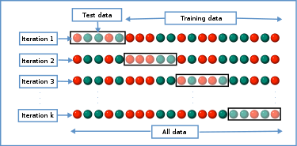

O objetivo desse notebook é aplicar a Linguagem R em Ciência de Dados na resolução de problemas de classificação. 

## Classificando flores

A base de dados iris fornece medidas em centímetros das variáveis largura e comprimento da sépala e largura e comprimento da pétala, respectivamente, para 50 flores, de cada uma das 3 espécies de íris.
      

```{r}
data('iris')
```

Podemos usar o scatterplot para entender o comportamento das classes 

```{r}
plot(iris[,1:4], col=iris$Species)
```

Devemos normalizar, uma vez que podemos utilizar algoritmos de classificação que são suscetíveis aos valores dos atributos.

```{r}
iris = data.frame(scale(iris[,1:4]), Species=iris$Species)
summary(iris)
```

Depois de carregar a base. Precisamos particionar o conjunto de treinamento e teste. Para essa e outras bases vamos usar o holdout com 70% para treinamento e 30% para teste.

```{r}
set.seed(123)
idx = sample(nrow(iris), 0.7*nrow(iris), replace=FALSE)
tran = iris[idx,]
test = iris[-idx,]
```

Podemos conferir se ocorreu contaminação.

```{r}
intersect(rownames(tran), rownames(test))
```

Agora podemos induzir alguns modelos de Aprendizado de Máquina. Vamos começar pela Árvore de Decisão.

```{r}
require('rpart')
model = rpart(Species~., iris)
```

No caso da Árvore de Decisão, é possível plotar o modelo. Para isso vamos usar a biblioteca rattle. 

```{r}
library('rattle')
fancyRpartPlot(model, caption=NULL)
```

Também podemos predizer a classe das amostras de teste.

```{r}
pred = predict(model, test, type='class')
```

E plotar o scatterplot para os dados de treinamento e teste.

```{r}
par(mfrow=c(1,2))
plot(tran[,3:4], col=tran$Species, pch=as.numeric(tran$Species))
plot(test[,3:4], col=pred, pch=as.numeric(pred))
```

Podemos avaliar de forma mais objetiva o desempenho do modelo.

```{r}
conf = table(test$Species, pred)
print(conf)
```

Inclusive, calcular a taxa de acerto.

```{r}
acc = sum(diag(conf))/sum(conf)
print(acc)
```

Existem outras medidas de avaliação. Recomendo olhar os pacotes 'caret' e 'mlr'.

Agora podemos induzir outros modelos de Aprendizado de Máquina. Para isso precisamos carregar algumas bibliotecas.

```{r}
require('kknn')
require('e1071')
require('randomForest')
```

Gerando os modelos de Aprendizado de Máquina.

```{r}
model1 = kknn(Species~., tran, test, k=3)
model2 = svm(Species~., tran, kernel="radial")
model3 = randomForest(Species~., tran)
```

Calculando a predição.

```{r}
pred1 = model1$fitted.values
pred2 = predict(model2, test, type='class')
pred3 = predict(model3, test)
```

Calculando o desempenho baseado na acurácia.

```{r}
acuracia <- function(orig, pred) {
  acc = table(orig, pred)
  sum(diag(acc))/sum(acc)  
} 

cat('A acurácia do 3NN é', acuracia(test$Species, pred1))
cat('A acurácia do SVM é', acuracia(test$Species, pred2))
cat('A acurácia do RF é', acuracia(test$Species, pred3))
```

No entanto, o holdout não é a melhor alternativa. A validação cruzada estratificada é mais interessante. Podemos ver na imagem um exemplo de seu funcionamento.



Podemos implementar :)

```{r}
kfolds <- function(y, folds) {

  names(y) =  1:length(y)
  index = lapply(1:nlevels(y), function(i) {
    rep(1:folds, length.out=length(y[y == levels(y)[i]]))
  })

  index = unlist(index)
  folds = lapply(1:folds, function(i) {
    as.numeric(names(y[index == i]))
  })

  return(folds)
}
```

E agora podemos usar.

```{r}
idx = kfolds(iris$Species, 10)

acc = lapply(idx, function(i){
  model = randomForest(Species~., iris[-i,])
  pred = predict(model3, iris[i,])
  acuracia(iris[i,]$Species, pred)
})

cat(mean(unlist(acc)), '+-', sd(unlist(acc)))
```
Outras meedidas de desempenho poderiam ser utilizadas.

```{r}
#F1-sconre
f1 <- function(conf) {
  prc = diag(conf)/colSums(conf)
  rec = diag(conf)/rowSums(conf)
  aux = (2 * prc * rec) / (prc + rec)
  return(mean(aux))
}

#AUC
require('ROCR')
auc <- function(class, pred) {
  aux = prediction(as.vector(pred), as.vector(class))
  aux = unlist(performance(aux, "auc")@y.values)
  return(aux)
}


```
## Classificando dígitos

Um experimento interessante é a tarefa de classificar dígitos utilizando o algoritmo de Redes Neurais Artificiais. Para isso precisamos relizar os experimentos em duas fases: (1) treinar a rede para reconhecer os dígitos e (2) utilizá-la para classificar novos dígitos. Para isso precisamos carregar as blbiotecas 'tensorflow' e 'keras'.  

```{r}
require('tensorflow')
require('keras')
```

A base de dados de dígitos se chama MNIST e pode ser carregada com a função dataset_mnist. Ela contém 60000 amostras dos dígitos 0 até 9. Cada dígito é uma imagem de 28 x 28 pixels. 

```{r}
mnist = dataset_mnist()
```

A função show_digit recebe um dígito na forma de uma matriz 28 x 28 e imprime o dígito na forma de imagem. 

```{r}
show_digit <- function(numero) {
  image(numero[1:28,28:1])
}
```

Podemos utilizar a função show_digit para plotar uma amostra de todos os dígitos presentes na base de dados. 

```{r}
par(mfrow=c(2,5))
plot = lapply(0:9, function(i) {
  aux = mnist$train$x[mnist$train$y == i,,][1,,]
  show_digit(t(aux))
})
```

Normalizando os dados de treinamento e teste.

```{r}
mnist$train$x = mnist$train$x/255
mnist$test$x = mnist$test$x/255
```

Construindo uma Rede Neural Artificial usando Keras. Essa rede é composta de uma camanda de entrada flatten (achatada de 28 x 28 neurônios), uma camada oculta dense (128 neurônios com função de ativação linear) e uma camada de saída dense (10 neurônios com função de ativação exponencial normalizada).

```{r}
modelo = keras_model_sequential() %>% 
  layer_flatten(input_shape = c(28, 28)) %>% 
  layer_dense(units = 128, activation = "relu") %>% 
  layer_dense(10, activation = "softmax")
```

Informações sobre a Rede Neural Artificial.

```{r}
summary(modelo)
```

Podemos representar graficamente:

```{r}
library(deepviz)
library(magrittr)
modelo %>% plot_model()
```

Ainda precisamos definir o algoritmo de treinamento, a função de avaliação e a medida de desempenho que vamos utilizar. Podemos fazer isso com a função compile.

```{r}
modelo %>% 
  compile(
    loss = "sparse_categorical_crossentropy",
    optimizer = "adam",
    metrics = "accuracy"
  )
```

Agora podemos treinar a rede.

```{r}
historico = modelo %>% 
  fit(
    x = mnist$train$x, y = mnist$train$y,
    epochs = 10,
    validation_split = 0.3,
    verbose = 2
  )
```

É interessante medir o erro e o desempenho da rede ao longo das épocas no conjunto de treinamento e validação.

```{r}
plot(historico)
```

Agora que sabemos que a rede aprendeu a reconhecer dígitos, podemos verificar seu desempenho no conjunto de teste. Para isso precisamos aplicar essas amostras nunca antes vistas na entrada da rede e obter os valores de saída. 

```{r}
predicao = predict(modelo, mnist$test$x)
head(predicao)
```

Cada neurônio de saída da rede irá retornar um valor. Aquele neurônio com maior valor deve indicar a classe com maior proababilidade.

```{r}
predicao = apply(predicao, 1, which.max)
predicao[1:6]
```

Calculando o desempenho da rede no conjunto de teste.

```{r}
acc = acuracia(mnist$test$y, predicao)
cat('A acurácia do modelo no conjunto de teste eh:', acc)
```

Agora podemos usar os modelos de Árvore de Decisão, kNN, SVM e Random Forest para comparar com o desempenho com a Rede Neural Artificial. Primeiro vamos construir uma base tabular com a mnist.

```{r}
tran = data.frame(mnist$train$x, y=as.factor(mnist$train$y))
test = data.frame(mnist$test$x, y=as.factor(mnist$test$y))
```

Agora podemos induzir outros modelos.

```{r}
model = rpart(y~., tran)
pred = predict(model, test, type='class')

cat('A acurácia da ANN é:', acc)
cat('A acurácia da DT é', acuracia(test$y, pred))
```
